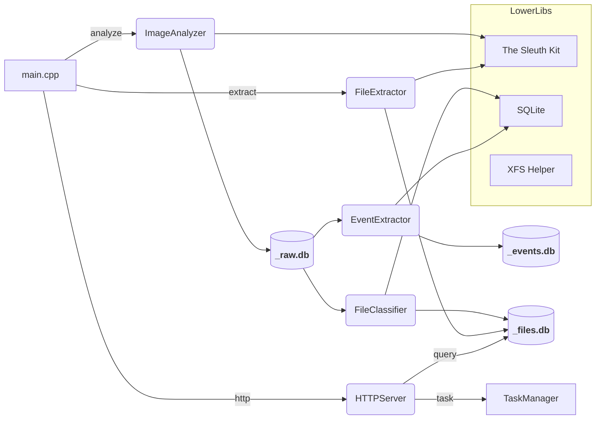

# 项目架构概览

下面用文字与简易 mermaid 图概述模块之间的关系，便于快速理解调用与数据流。

## 模块关系（文字说明）
- `main.cpp` 为程序入口，解析命令行并触发三种主流程：分析（ImageAnalyzer）、提取（FileExtractor）或 HTTP 服务（HTTPServer）。
- `ImageAnalyzer` 打开镜像并将元数据写入 `_raw.db`（通过 `DatabaseManager`）。
- `EventExtractor` 从 `_raw.db` 生成 `_events.db` 的事件时间线。
- `FileClassifier` 从 `_raw.db` 生成 `_files.db` 的分类表与视图。
- `FileExtractor` 根据 `_files.db` 或 `_raw.db` 从镜像提取文件内容。
- `HTTPServer` 通过 `SQLiteHelper` 查询数据库，并使用 `TaskManager` 管理异步分析任务。

## Mermaid 草图

## 部署建议
- 将 HTTP 服务与分析 worker 分离部署：HTTP 负责接收/管理任务，后台 worker（可在同机或不同机）拉取任务并执行分析，完成后回写数据库并通过 `TaskManager` 更新状态。
- 为高并发读场景使用 SQLite 的 WAL 模式，或将查询层迁移到只读副本数据库（如 PostgreSQL）以扩展读能力。

----

*此架构文档为快速参考，若需要更详细的 UML 或 sequence diagram，我可以基于代码生成 mermaid 的类或序列图。"
